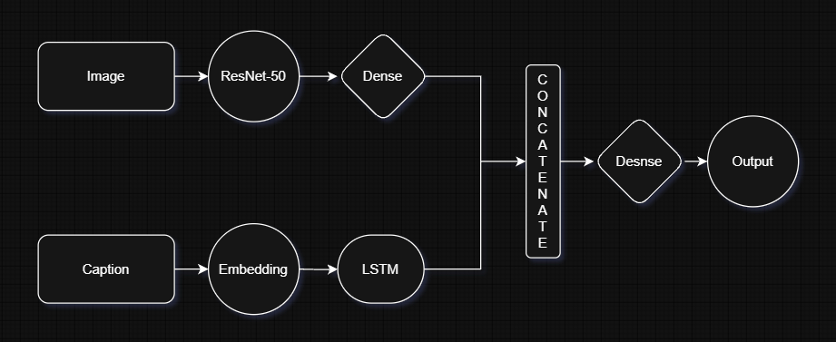

# Image Caption Generator

An end-to-end deep learning application designed to automatically generate descriptive text captions for images. Built with a modular pipeline structure, tracked using DVC (Data Version Control), and served via a web interface.

---

## Workflow Architecture

Below is the workflow and model pipeline architecture for this project:

---

## Key Features

* **Modular Pipeline Design:** Organized into clear execution steps (data ingestion, validation, transformation, model training, and evaluation).
* **DVC Integration:** Tracks data and pipeline stages (`dvc.yaml`, `dvc.lock`) for reproducible machine learning workflows.
* **Web Interface:** Interactive web application (`app.py` / `templates/`) allowing users to upload images and generate captions in real-time.
* **Evaluation:** Evaluates model performance and saves metric artifacts (`scores.json`).

---

## Technical Stack

* **Language:** Python
* **ML/DL Frameworks:** TensorFlow
* **Pipeline & Versioning:** DVC
* **Web Application:** Flask
* **Deployment & Setup:** `setup.py`, `requirements.txt`

---